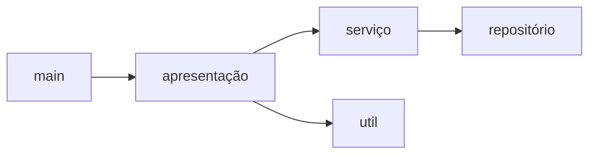

# Roteiro de Refactoring (versão JavaScript)

**Prof. Marco Tulio Valente**

Neste roteiro, você vai colocar em prática os conceitos de refactoring aprendidos na 
sala de aula. Para isso, você vai realizar alguns refactorings em um sistema hipotético, 
também usado no primeiro capítulo da segunda edição do 
[livro](https://martinfowler.com/books/refactoring.html)
do Martin Fowler, que é o livro clássico sobre o tema.

Para tirar proveito do roteiro é **importante não apenas seguir os passos mecanicamente, 
mas também analisar os benefícios alcançados com cada refactoring**. Ou seja, pense 
sempre nos motivos que tornam o código refatorado melhor do que o código anterior.

Em caso de dúvida, você pode consultar o [Capítulo 9](https://engsoftmoderna.info/cap9.html) 
do nosso livro.

O exemplo está em JavaScript, mas a sintaxe é familiar mesmo para aqueles que nunca programaram 
nessa linguagem. 

Para executar o código, você vai precisar instalar o `node.js`. Para mais informações clique 
[aqui](https://nodejs.org/en/download). Você vai precisar também de uma IDE, como o VS Code.

Instruções:

* Primeiro, faça um fork deste repositório e, depois, um clone para sua máquina local.

* Siga o roteiro, refactoring a refactoring.

* Após cada etapa, dê um **COMMIT & PUSH**, adicionando uma descrição (mensagem) no commit 
conforme as instruções do roteiro. Esses commits serão usados na correção, para garantir 
que você realizou todos os refactorings solicitados. 

* Códigos que não compilam -- em qualquer um dos refactorings e passos -- serão avaliados 
  com nota zero pelo nosso sistema de correção automática.

## 1. Função Inicial

A função que iremos refatorar faz parte de um sistema usado por uma companhia de teatro
para gerar faturas. Explicando um pouco mais, essa companhia faz apresentações 
de algumas peças para clientes. E ela quer no final do mês gerar uma 
fatura para tais clientes, com o valor do serviço prestado.

Primeiro, estude a versão inicial da função `gerarFaturaStr`, 
disponível neste [link](https://github.com/mtov/RoteiroRefactoringJS/blob/main/index.js).

**Importante:**

* Veja que temos uma função monolítica que cuida de dois interesses: cálculo dos valores
que vão constar da fatura e formatação de uma string com o texto da fatura.

* No código, usamos o termo `peca` (sem cedilha) para denotar uma peça apresentada
  pela companhia. Por isso, existem funções chamadas, por exemplo, `getPeca`. 

* Os dados das apresentações feitas pela companhia de teatro estão
em um 
[arquivo](https://github.com/mtov/RoteiroRefactoringJS/blob/main/faturas.json) 
no formato JSON. Em um segundo 
[arquivo](https://github.com/mtov/RoteiroRefactoringJS/blob/main/pecas.json), 
estão informações sobre as peças do repertório da companhia de teatro.

Execute também a função do exemplo usando o comando: 

`node index.js`

O resultado deve ser o seguinte:

```
Fatura UFMG
  Hamlet: R$ 650,00 (55 assentos)
  As You Like It: R$ 580,00 (35 assentos)
  Othello: R$ 500,00 (40 assentos)
Valor total: R$ 1.730,00
Créditos acumulados: 47 
 ```

Em seguida, dê um **Commit & Push**, com a descrição: "Commit 1 - Versão inicial".

## 2. Extração de Função

Agora, você deve extrair uma função com o código do `switch` interno a `gerarFaturaStr`. 
A nova função deve se chamar `calcularTotalApresentacao` e, portanto, vai calcular 
o valor que deve ser pago para uma apresentação. 

Após a extração, o código ficará assim:

```js
function gerarFaturaStr(fatura, pecas) {

    // função extraída
    function calcularTotalApresentacao(apre, peca) {
      let total = 0;
      switch (peca.tipo) {
        ...
      ...
      return total;
    }
    ...
    let total = calcularTotalApresentacao(apre, peca);
    ....
}          
```

Importante: veja que em JavaScript podemos ter uma função implementada dentro de uma função 
mais externa.

Execute seu código, para garantir que está tudo funcionando corretamente.

Em seguida, dê um **Commit & Push**, com a descrição: "Commit 2 - Extração de Função".

## 3. Replace Temp with Query

Esse refactoring substitui uma variável local (`temp`) por uma função que 
apenas retorna o seu valor, isto é, uma *query*.

Vamos então substituir a variável local `peca` usada no corpo principal 
de `gerarFaturaStr` por uma função que retorna o nome completo de uma
peça do repertório da companhia.

Primeiro, vamos criar a função *query*  (`getPeca`) e chamá-la no corpo 
principal de `gerarFaturaStr`.

```js
function gerarFaturaStr(fatura, pecas) {

     // função query
    function getPeca(apresentacao) {
      return pecas[apresentacao.id];
    }
    ...
    
    for (let apre of fatura.apresentacoes) {
      const peca = getPeca(apre);
```

No próximo passo, você deve:
- deletar a declaração da variável local `peca`. Isto é, deletar (ou comentar) a linha

  `const peca = getPeca(apre);` 
  
- substituir todo uso de `peca` por uma chamada a `getPeca(apre)`. Ao todo, 
`peca` é usada em três pontos no corpo principal da função.

Feito isso, rode o código para garantir que está tudo funcionando.

**Qual o benefício desse refactoring?**

Após esse refactoring, nós podemos prosseguir e remover também o parâmetro `peca` de 
`calcularTotalApresentcao` e substituir os seus usos por chamadas a `getPeca`. 
Isso torna a função mais simples, pois ela terá apenas um parâmetro, em vez de 
dois como antes.

Especificamente, você deve:
- remover o parâmetro `peca` de `calcularTotalApresentacao`. Logo, ela terá agora 
  um único parâmetro (`apre`).
- No corpo de `calcularTotalApresentacao`, substituir todos os usos do parâmetro 
  removido por chamadas a `getPeca`.
- Atualizar a chamada de `calcularTotalApresentacao`, no corpo da função principal, 
  para agora usar apenas um parâmetro de chamada.

Em seguida, dê um **Commit & Push**, com a descrição: "Commit 3 - Replace Temp with Query
".

## 4. Mais Extração de Funções

#### Extraindo a função `CalcularCredito`

Vamos agora extrair mais uma função, para calcular quantos créditos o cliente 
ganhará com uma apresentação. No nosso sistema, os créditos são uma espécie de bônus
ou descontos para compras de apresentações de teatro no futuro.

Veja como ficará o código:

```js
function gerarFaturaStr(fatura, pecas) {

    // função extraída
    function calcularCredito(apre) {
      let creditos = 0;
      creditos += Math.max(apre.audiencia - 30, 0);
      if (getPeca(apre).tipo === "comedia") 
         creditos += Math.floor(apre.audiencia / 5);
      return creditos;   
    }
    ....
```

Claro, não se esqueça de remover o código extraído do corpo da função principal.
E de também chamar a nova função (`calcularCredito`).

Feito isso, rode o código para garantir que está tudo funcionando.

#### Extraindo a função `formatarMoeda`

Para simplificar, vamos também extrair a inicialização da variável local 
`format` para uma função e remover essa variável:

```js
function gerarFaturaStr(fatura, pecas) {

    // função extraída
    function formatarMoeda(valor) {
      return new Intl.NumberFormat("pt-BR",
        { style: "currency", currency: "BRL",
          minimumFractionDigits: 2 }).format(valor/100);
    }
```

Feito isso, remova o código extraído do corpo da função principal e, no seu lugar, 
chame a nova função (`formatarMoeda`). 

Para garantir que está tudo correto, rode o código.

Em seguida, dê um **Commit & Push**, com a descrição: "Commit 4 - Mais Extract Functions".

## 5. Separando Apresentação dos Cálculos

Agora, estamos em um ponto importante do roteiro, no qual vamos fazer uma simplificação grande 
no corpo da função principal, que deverá ficar assim:

```js
function gerarFaturaStr(fatura, pecas) {

  // funções aninhadas

  // corpo principal (após funções aninhadas)
  let faturaStr = `Fatura ${fatura.cliente}\n`;
  for (let apre of fatura.apresentacoes) {
      faturaStr += `  ${getPeca(apre).nome}: ${formatarMoeda(calcularTotalApresentacao(apre))} (${apre.audiencia} assentos)\n`;
  }
  faturaStr += `Valor total: ${formatarMoeda(calcularTotalFatura())}\n`;
  faturaStr += `Créditos acumulados: ${calcularTotalCreditos()} \n`;
  return faturaStr;
}  
```

Esse código apenas retorna uma string com a fatura formatada. Para que ele funcione corretamente, 
você deverá extrair mais uma função, chamada `calcularTotalFatura()`, que já está sendo chamada 
no código acima.

Explicando melhor: agora, temos um método focado em apresentação (ou interface com o usuário), 
cujo corpo principal possui poucas linhas de código e que é muito menor do que a versão 
inicial com a qual começamos o roteiro. Evidentemente, esse método chama métodos 
para cálculo dos totais da fatura, especificamente:

* `calcularTotalApresentacao`
* `calcularTotalFatura`
* `calcularTotalCreditos`

Para garantir que está tudo funcionando, rode o código.

Em seguida, dê um **Commit & Push**, com a descrição: "Commit 5 - Separando Apresentação dos Cálculos".

## 6. Move Function

Agora você deve mover todas as funções aninhadas em `gerarFaturaStr` para "fora" dessa função.

Normalmente, um Move Function move funções de um arquivo para outro; mas vamos considerar
que ele aplica-se também a movimentações de funções aninhadas para um escopo mais externo.

Após essa refatoração, o código vai ficar como mostrado a seguir. Observe que algumas funções 
ganharam um parâmetro extra (`pecas`). Logo, a chamada delas deve ser ajustada para incluir 
esse novo parâmetro.

```js
function formatarMoeda(valor) {
  ...
}

function getPeca(pecas, apre) {
  ...
}

function calcularCredito(pecas, apre) {  
  ...
}

function calcularTotalCreditos(pecas, apresentacoes) {
  ...
}

function calcularTotalApresentacao(pecas, apre) {
  ...
}

function calcularTotalFatura(pecas, apresentacoes) {
   ...
}

function gerarFaturaStr(fatura, pecas) {
  ...
}    
```

Para garantir que está tudo funcionando, rode o código.

Em seguida, dê um **Commit & Push**, com a descrição: "Commit 6 - Move Function".

## 7. Fatura em HTML

O refactoring anterior facilita a criação de um segundo tipo de fatura, agora em 
HTML, tal como mostrado a seguir:

```html
<html>
<p> Fatura UFMG </p>
<ul>
<li>  Hamlet: R$ 650,00 (55 assentos) </li>
<li>  As You Like It: R$ 580,00 (35 assentos) </li>
<li>  Othello: R$ 500,00 (40 assentos) </li>
</ul>
<p> Valor total: R$ 1.730,00 </p>
<p> Créditos acumulados: 47 </p>
</html>
```

Especificamente, você deverá:

* Implementar uma nova função `gerarFaturaHTML` que retorna uma fatura como essa acima.
* Acrescentar uma chamada para essa função no programa principal.

Ou seja, teremos agora duas funções para geração de faturas:

```js
function gerarFaturaStr(fatura, pecas) {
  ...
}

function gerarFaturaHTML(fatura, pecas) {
  ...
}
```

É importante refletir sobre como foi fácil criar essa segunda forma de 
apresentação de uma fatura. Todas as funções de cálculo foram integralmente 
reusadas. Sendo mais claro, a mudança ficou restrita à lógica de apresentação e 
não precisamos modificar nenhuma lógica de negócio.

Para garantir que está tudo funcionando, rode o código. Veja que agora o 
programa deverá exibir duas faturas: uma em string e outra em HTML.

Em seguida, dê um **Commit & Push**, com a descrição: "Commit 7 - Fatura em HTML".

Uma última reflexão importante, antes de concluir: tecnicamente, neste passo, o que 
fizemos não foi uma refatoração, mas a adição de uma nova funcionalidade no programa.
Ou seja, o seu comportamento mudou, pois ele passou a exibir como saída faturas 
também em HTML.

## 8. Criando uma Classe de Serviço

Agora, vamos fazer uma mudança muito importante no programa: criar uma
classe, chamada `ServicoCalculoFatura`, para modularizar a implementação das
funções de cálculo. 

Essa classe vai ter o seguinte código:

```js
class ServicoCalculoFatura {

   calcularCredito(pecas, apre) {
     ...
   }
   
   calcularTotalCreditos(pecas, apresentacoes) {
      ...
   }
   
   calcularTotalApresentacao(pecas, apre) {
      ...
   }
   
   calcularTotalFatura(pecas, apresentacoes) {
      ... 
   }
}
```

Ou seja, criamos a classe e movemos para ela todos os métodos de cálculo.

Importante:

1. Os métodos de uma classe não são precedidos de `function`.

2. Quando um método da classe chama um outro método, a chamada deve ser feita 
tendo como alvo o objeto `this`. Exemplo:

```js
calcularTotalFatura(pecas, apresentacoes) {
   ...
   total += this.calcularTotalApresentacao(pecas, apre); 
   ...
}  
```

3. No programa principal, você deve criar um objeto da nova classe
e passá-lo como parâmetro de `gerarFaturaStr`

```js
const calc = new ServicoCalculoFatura();
const faturaStr = gerarFaturaStr(faturas, pecas, calc);
```

4. Por fim, no corpo de `gerarFaturaStr` as chamadas dos métodos de cálculo usarão 
o parâmetro `calc` como alvo. Veja um exemplo:

```js
calc.calcularTotalApresentacao(pecas, apre)
```

5. Para evitar que o programa fique com duas saídas, comente o corpo da função
`gerarFaturaHTML` e sua respectiva chamada. Ou seja, vamos voltar a ter apenas 
uma saída, apenas por questões de simplicidade.

Para garantir que está tudo funcionando, rode o código. 

Em seguida, dê um **Commit & Push**, com a descrição: "Commit 8 - Classe ServicoCalculoFatura".

## 9. Criando um Repositório

Agora vamos criar nossa segunda classe, chamada `Repositorio`, que vai encapsular 
o acesso ao arquivo JSON com informações sobre as peças do repertório da companhia 
de teatro. Segue o seu código:

```js
class Repositorio {
  constructor() {
    this.pecas = JSON.parse(readFileSync('./pecas.json'));
  }

  getPeca(apre) {
    return this.pecas[apre.id];
  }
}
```

E também crie um construtor na classe `ServicoCalculoFatura`:

```js
class ServicoCalculoFatura {

   constructor(repo) {
     this.repo = repo;
  }
 ...
```  

Em seguida, faça os ajustes necessários:

1. Todos os métodos `calcular` de  `ServicoCalculoFatura` não precisam mais do 
parâmetro `pecas`, que poderá ser removido.

2. Agora, esses métodos vão ter que chamar `getPecas` como nesse exemplo:

```js
if (this.repo.getPeca(apre).tipo === "comedia") 
```  

3. A função `gerarFaturaStr` também não vai mais precisar do parâmetro `pecas`, 
que poderá ser removido.

4. Em `gerarFaturaStr`, a chamada a `getPecas` deverá ser feita assim:

```js
calc.repo.getPeca(apre).nome
``` 

5. No programa principal, não vamos mais precisar de ler o arquivo de peças.
Veja o código dele a seguir:

```js
const faturas = JSON.parse(readFileSync('./faturas.json'));
const calc = new ServicoCalculoFatura(new Repositorio());
const faturaStr = gerarFaturaStr(faturas, calc);
console.log(faturaStr);
```
Para garantir que está tudo funcionando, rode o código. 

Em seguida, dê um **Commit & Push**, com a descrição: "Commit 9 - Classe Repositorio".

Quais foram as vantagens da criação dessas classes? 

* Conseguimos separar mais um requisito do sistema: a recuperação de dados de peças, 
que atualmente estão em um arquivo JSON. Se amanhã quisermos armazenar esses dados 
em um banco de dados, precisaremos apenas de criar um novo repositório, 
por exemplo, `RepositorioBD`.

* O repositório agora é um atributo da classe `ServicoCalculoFatura. Com isso,
conseguimos tornar a assinatura dos métodos de cálculo mais simples, isto é,
com um parâmetros a menos.

## 10. Particionamento em Arquivos 

Vamos agora criar alguns arquivos e mover as classes e funções atuais para
eles.

Para começar, crie um arquivo `repositorio.js` e mova a classe `Repositorio` para ele.
E não esqueça de exportá-la conforme requerido pelo Node.js:

```js
// arquivo repositorio.js
const { readFileSync } = require('fs');

module.exports = class Repositorio {
    constructor() {
      this.pecas = JSON.parse(readFileSync('./pecas.json'));
    }
  
    getPeca(apre) {
      return this.pecas[apre.id];
    }
}
```

No arquivo principal, importe essa classe:

```js
var Repositorio = require("./repositorio.js");
```

Para garantir que está tudo funcionando, rode o código. 

Agora crie mais três arquivos:

* `util.js`: e mova para ele a função `formatarMoeda`.
* `servico.js`: e mova para ele a classe `ServicoCalculoFatura`.
* `apresentacao.js`: e mova para ela a função `gerarFaturaStr`.

Feito isso, o arquivo principal (`index.js`) deverá ficar assim:

```js
const { readFileSync } = require('fs');

var Repositorio = require("./repositorio.js");
var ServicoCalculoFatura = require("./servico.js") ;
var gerarFaturaStr = require("./apresentacao.js");

// main
const faturas = JSON.parse(readFileSync('./faturas.json'));
const calc = new ServicoCalculoFatura(new Repositorio());
const faturaStr = gerarFaturaStr(faturas, calc);
console.log(faturaStr);
```

Em seguida, dê um **Commit & Push**, com a descrição: "Commit 10 - Criando Arquivos".

Antes de concluirmos, veja a arquitetura final do sistema:



## Comentários Finais

Neste roteiro, nós começamos com uma função monolítica para geração de faturas, com
74 linhas de código.

E, por meio de sucessivas refatorações, extraímos vários interesses dessa função:

* Primeiro, quebramos a função original em funções menores, mas ainda aninhadas.

* Depois, criamos uma classe com métodos para cálculo dos valores da fatura. Com isso, 
  viabilizamos uma segunda interface para o sistema, em HTML.
 
* Nos passos seguintes, extraímos uma classe de serviço e um repositório. Com isso, diminuímos o 
acoplamento entre as funções de cálculo, que passaram a ter um parâmetro a menos. Já a classe
repositório encapsulou o acesso a um dos arquivos JSON.

* Por fim, dividimos as funções e classes em quatro arquivos: função de interface com o usuário, 
classe de serviço (lógica de negócio), repositório (acesso a dados) e funções utilitárias. 
No arquivo principal, ficou apenas o programa principal, com 11 linhas de código.

**Vantagens da versão refatorada:**
* Código mais simples e fácil de entender
* Código mais simples de evoluir, isto é, implementar novas funcionalidades

**Desvantagens da versão refatorada:**
* O código monolítico tem menos chamadas de função, logo ele possui um melhor desempenho. Por 
  outro lado, esse ganho somente será perceptível e relevante caso o código seja executado em 
  um hardware muito limitado e caso desempenho seja um requisito muito importante e crítico.
